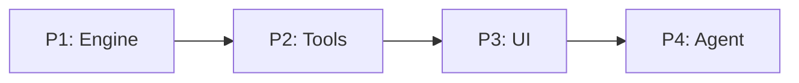

# Approach: TOTM (Theater of the Mind)

## Strategy

Phased, sequential build. TOTM is a greenfield project — we begin with core data models and the deterministic state engine, then layer orchestration tools, UI shell, and finally AI integration. Each partition owns a distinct module boundary under `src/totm/`. Partitions are ordered by dependency: downstream partitions consume the API surface of upstream ones.

## Partitions (Feature Branches)

### Partition 1: Data Models & State Engine → `feat/engine`
**Modules**: `src/totm/engine/`
**Scope**: All data models (`Character`, `Location`, `Journey`, `WorldGraph`) and the `StateEngine` class (CRUD, persistence, deterministic adjudication). This is the authoritative "Solid Ground" layer — everything else depends on it.
**Dependencies**: None

#### Implementation Steps
1. Define `Character` class with class archetypes (Warrior, Mage, Cleric, Thief) and stats (brawn, brains, faith, speed, hp, xp). Include JSON serialization.
2. Define `Location` node model (id, name, description, npcs, inventory, gm_guide).
3. Define `Journey` edge model (from, to, direction, duration, difficulty, risks, description).
4. Implement `WorldGraph` for region-scoped directed graph operations (add/get location, add/get edges, neighbors).
5. Implement `StateEngine` with active character tracking, current location, save/load (JSON).
6. Implement deterministic `traverse` adjudication (stat checks vs edge difficulty → result object).
7. Implement `interact` adjudication logic for NPC encounters.
8. Bootstrap a prototype world graph (Well scenario from tech-design).

### Partition 2: Arbiter Tools → `feat/tools`
**Modules**: `src/totm/tools/`
**Scope**: The bridge between the StateEngine and the GM Agent. Exposes a clean tool API: `get_location`, `get_exits`, `traverse`, `interact`, `update_character`. Each tool wraps StateEngine operations and returns structured result objects suitable for LLM consumption.
**Dependencies**: Requires Partition 1 (engine)

#### Implementation Steps
1. Define tool interface/protocol (input schema, result object schema).
2. Implement `get_location()` — returns current location data with GM guide.
3. Implement `get_exits()` — returns connected edges with direction and risk labels.
4. Implement `traverse(edge_id)` — delegates to StateEngine adjudication, returns result object.
5. Implement `interact(npc_id, action)` — delegates to StateEngine, returns outcome.
6. Implement `update_character(stats)` — commits character class and stats during Preparation Phase.

### Partition 3: Terminal UI & Game Flows → `feat/ui`
**Modules**: `src/totm/ui/`
**Scope**: The terminal-based user interface: main menu, Preparation Phase flow (narrative character creation), Gameplay Phase serial console, plain text trigger parsing, and rich text formatting for GM output. Owns the application entry point (`app.py`).
**Dependencies**: Requires Partition 1 (engine), Partition 2 (tools)

#### Implementation Steps
1. Implement terminal Main Menu (New Game, Load Game, Save Game, Create Character, Play).
2. Implement the Preparation Phase flow (GM-guided character creation dialogue).
3. Implement the Gameplay Phase serial console (prompt loop, GM narration display).
4. Implement Plain Text Trigger parser (mapping natural language intents to tool calls).
5. Add "Thinking..." indicators and rich text formatting for GM output.
6. Wire up `app.py` entry point with menu routing.

### Partition 4: GM Agent & Knowledge → `feat/agent`
**Modules**: `src/totm/agent/`
**Scope**: The AI Game Master: system prompt (persona, constraints, tool usage instructions), context injection logic (building the context window from StateEngine state each turn), Rulebook RAG integration, and the Epoch summarization system.
**Dependencies**: Requires Partition 1 (engine), Partition 2 (tools), Partition 3 (ui — for integration)

#### Implementation Steps
1. Define the GM System Prompt (persona, constraints, tool-use instructions, state-narrative injection rules).
2. Implement context injection logic — dynamically build the prompt from current location, exits, character stats, and epoch summaries.
3. Integrate with an LLM provider (API client, response streaming).
4. Implement Rulebook RAG (retriever for dynamic rule reference).
5. Implement the Epoch system (automated summarization triggers, overview + detail storage).

## Sequencing

Strictly sequential — each partition depends on the one before it. No parallelism.

## Migrations & Compat
Greenfield project — no existing data or users. No migration concerns.

## Risks & Mitigations

| Risk | Mitigation |
|------|------------|
| **World Hallucination** | Authoritative state injection in every LLM turn; GM cannot overwrite SE state. |
| **Logic Drift** | Strict deterministic results from Arbiter Tools; GM narrates but never adjudicates. |
| **Context Exhaustion** | Hierarchical world model; only immediate proximity loaded per turn. Epoch summaries for long-term memory. |
| **User Friction** | Serial interaction with Plain Text Triggers (voice-friendly). State-narrative injection reduces manual querying. |
| **Module Overlap** | Clean partition boundaries — each partition owns a single `src/totm/` subdirectory. |
| **LLM Provider Lock-in** | Abstract LLM client behind an interface in the agent module. |

## Alternatives Considered
- **Vertical slices** (full feature per partition): Rejected because the engine is a prerequisite for everything — horizontal layering avoids duplication and establishes the authoritative state layer first.
- **Parallel partitions**: Not feasible due to strict dependency chain (tools need engine, UI needs tools, agent needs all three).
- **Database-backed persistence**: Deferred to v2. JSON file persistence is simpler for MVP and avoids schema migration overhead.
