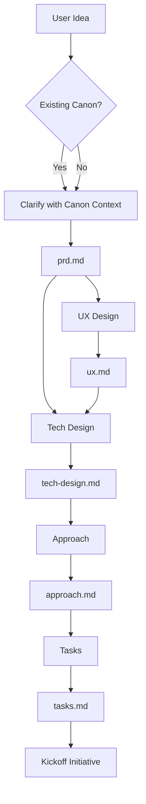

# Emergence: The Cicadas Drafting Phase

> "Everything begins in the dark."

The **Emergence** phase is where vague ideas are refined into structured, actionable specifications *before* a branch is created and code is written.

Depending on project maturity, this phase either builds upon existing **Canon** (brownfield) or starts from scratch (greenfield).

## The Drafts Area

All work in this phase happens in `.cicadas/drafts/{initiative-name}/`. This is a sandbox for drafting. Files here are transient and not yet part of the project's official history.

### Workflow

1. Create folder: `.cicadas/drafts/{initiative-name}/`
2. Draft docs using subagents (below) or manually.
3. Builder reviews each artifact before proceeding to the next.
4. Run `python scripts/chorus/scripts/kickoff.py {initiative-name} --intent "description"`:
   - Moves docs to `.cicadas/active/{initiative-name}/`.
   - Registers the initiative in `registry.json`.
   - Creates the initiative branch: `initiative/{name}`.
5. Create feature branches for each partition: `python scripts/chorus/scripts/branch.py {name} --initiative {initiative-name} ...`

## The Workflow

The Emergence phase consists of 5 progressive steps. Each step is handled by a specialized subagent (or a human wearing that hat).

| Step | Artifact | Subagent | Focus |
|------|----------|----------|-------|
| **1. Clarify** | `prd.md` | `emergence/clarify` | **What & Why**. Problem, users, success criteria. |
| **2. UX** | `ux.md` | `emergence/ux` | **Experience**. Interaction flow, UI states, copy. |
| **3. Tech** | `tech-design.md` | `emergence/tech-design` | **Architecture**. Components, data flow, schemas. |
| **4. Approach** | `approach.md` | `emergence/approach` | **Strategy & Partitioning**. Implementation plan, sequencing, dependencies, and logical partitions (which become Feature Branches). |
| **5. Tasks** | `tasks.md` | `emergence/tasks` | **Execution**. Ordered, testable checklist grouped by partition. |

### Progressive Refinement

- **Input**: Each step consumes the artifacts from the previous steps.
- **Canon-Aware**: On brownfield projects, each subagent reads existing canon as context. This produces sharper, more targeted specs.
- **Gate**: Human review is required after each step.
- **Skip**: For simple changes, UX and Tech Design can be skipped or merged into simpler artifacts.

## Usage

### Starting an Initiative
1. Create folder: `.cicadas/drafts/{initiative-name}/`
2. Run the **Clarify** subagent.

### The Flow

## Subagent References

- [Clarify](./clarify.md)
- [User Experience](./ux.md)
- [Technical Design](./tech-design.md)
- [Approach](./approach.md)
- [Tasks](./tasks.md)
