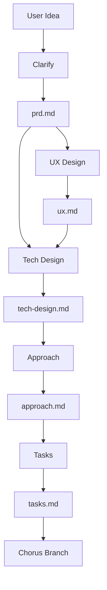

# Emergence: The Cicadas Forward Path

> "Everything begins in the dark."

The **Emergence** phase is the "forward path" of Cicadas. It is where vague ideas are refined into structured, actionable specifications *before* a branch is created and code is written. 

Depending on project maturity, this phase either builds upon existing **Canon** (Brownfield) or establishes a new **Provisional Canon** via a **Brood** (Greenfield/Large Initiative).

## The Incubator

All work in this phase happens in `.cicadas/incubator/{feature-name}/`. This is a sandbox for drafting. Files here are transient and not yet part of the project's official history.

### Simple Feature: Incubator -> Branch
1. Create folder: `.cicadas/incubator/{feature-name}/`
2. Draft docs using subagents.
3. Run `chorus branch {feature-name}`:
    - Creates git branch.
    - Moves docs to `.cicadas/forward/{feature-name}/`.

### Complex Initiative: Incubator -> Brood -> Multi-Branch
1. Create folder: `.cicadas/incubator/{initiative-name}/`
2. Draft shared docs (PRD, UX, Tech Design).
3. Run `chorus brood hatch {initiative-name}`:
    - Moves docs to `.cicadas/forward/broods/{initiative-name}/`.
    - These shared docs act as a **Provisional Canon**.
4. Create specific branches: `chorus branch {branch-name} --brood {initiative-name}`.
    - Branches share the Brood docs but carry their own `tasks.md`.

## The Workflow

The Emergence phase consists of 5 progressive steps. Each step is handled by a specialized subagent (or a human wearing that hat).

| Step | Artifact | Subagent | Focus |
|------|----------|----------|-------|
| **1. Clarify** | `prd.md` | `emergence/clarify` | **What & Why**. Problem, users, success criteria. |
| **2. UX** | `ux.md` | `emergence/ux` | **Experience**. Interaction flow, UI states, copy. |
| **3. Tech** | `tech-design.md` | `emergence/tech-design` | **Architecture**. Components, data flow, schemas. |
| **4. Approach** | `approach.md` | `emergence/approach` | **Strategy**. Implementation plan, migration, risks. |
| **5. Tasks** | `tasks.md` | `emergence/tasks` | **Execution**. Ordered, testable checklist. |

### Progressive Refinement

- **Input**: Each step consumes the artifacts from the previous steps.
- **Gate**: Human review is required after each step.
- **Skip**: For simple changes, UX and Tech Design can be skipped or merged into simpler artifacts.

## Usage

### Starting Clean
To start a new feature idea:
1. Create folder: `.cicadas/incubator/my-feature/`
2. Run the **Clarify** subagent.

### The Flow

## Subagent References

- [Clarify](./clarify.md)
- [User Experience](./ux.md)
- [Technical Design](./tech-design.md)
- [Approach](./approach.md)
- [Tasks](./tasks.md)
