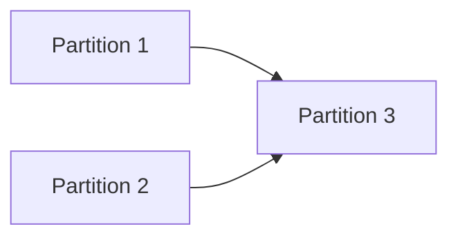

# Approach: {Initiative Name}

## Strategy
{High-level plan: sequential, parallel, phased?}

## Partitions (Feature Branches)

### Partition 1: {Name} → `feat/{branch-name}`
**Modules**: `{module1}`, `{module2}`
**Scope**: {What this partition implements}
**Dependencies**: None / Requires Partition X

#### Implementation Steps
1. {Step 1}
2. {Step 2}

### Partition 2: {Name} → `feat/{branch-name}`
**Modules**: `{module3}`
**Scope**: {What this partition implements}
**Dependencies**: {Dependency description}

#### Implementation Steps
1. {Step 1}
2. {Step 2}

## Sequencing
{Which partitions can run in parallel? Which must be sequential?}

## Migrations & Compat
{How to handle existing data/users without downtime}

## Risks & Mitigations
| Risk | Mitigation |
|------|------------|
| {Risk} | {Mitigation} |

## Alternatives Considered
{Why we didn't do something else}
