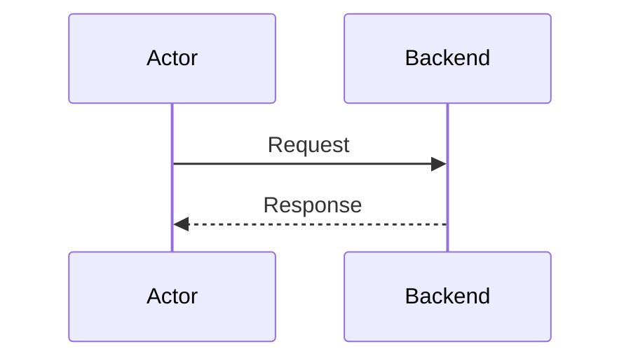

# Tech Overview

> Generated by Chorus on {timestamp}.

## Codebase Overview
{High-level structure and organization of the repository}

## Key Functional Components
| Component | Responsibility | Dependencies |
|-----------|----------------|--------------|
| {Name} | {Responsibility} | {Deps} |

## External API Specifications
- **{API Name}**: {Link to spec or description}
- **{API Name}**: {Link to spec or description}

## Data Models & Schemas
### {Model Name}
- {Field}: {Type} - {Description}

## Key Flows (Sequence Diagrams)

### {Flow Name}

